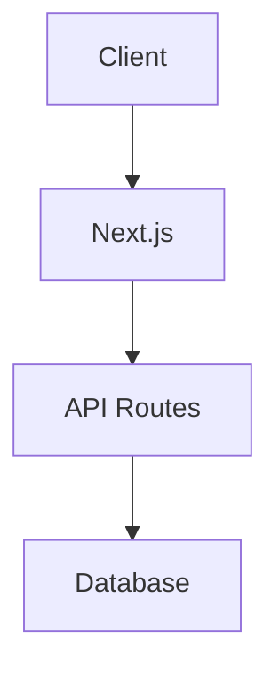
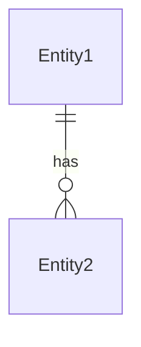

# アーキテクチャ設計

`$ARGUMENTS` のアーキテクチャ設計を行う。

## 手順

1. **現状分析**: 既存コードベースの構造を調査する
2. **要件整理**: 機能要件・非機能要件を整理する
3. **技術選定**: 使用する技術・ライブラリを選定する
4. **設計**: システム構成を設計する
5. **文書化**: `docs/architecture/` に保存する

## 出力内容

### 1. 設計概要

- 設計の目的と範囲
- 主要な設計判断とその理由

### 2. 技術選定

各技術について以下を記述する:

| 技術/ライブラリ | 用途 | 選定理由 | 代替案 |
|----------------|------|---------|--------|
| | | | |

### 3. システム構成図

Mermaid記法でシステム構成を図示する:



### 4. データモデル



- 各エンティティのフィールド定義
- リレーション定義
- インデックス設計

### 5. API設計

| メソッド | パス | 説明 | リクエスト | レスポンス |
|---------|------|------|-----------|-----------|
| | | | | |

### 6. ディレクトリ構成

新規追加・変更するファイルの一覧:

```
src/
├── app/api/[新規エンドポイント]/
├── components/[新規コンポーネント]/
├── services/[新規サービス]/
└── types/[新規型定義]/
```

### 7. リスクと対策

| リスク | 影響度 | 対策 |
|--------|--------|------|
| | | |

## 注意事項

- 既存のコードパターン・アーキテクチャとの整合性を確認する
- `.claude/rules/project-structure.md` のディレクトリ構成ルールに従う
- 過度に複雑な設計を避け、シンプルさを優先する
- このスキルは独立コンテキストで実行されるため、メインの会話には影響しない
